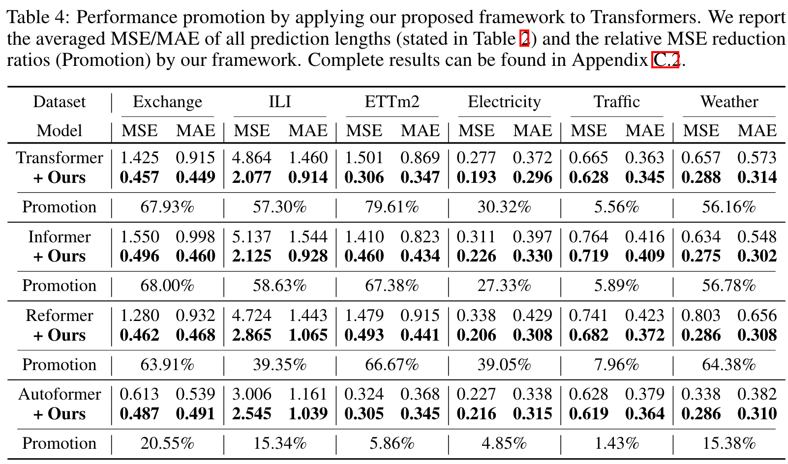

# Non-stationary Transformers

This is the codebase for the paper:
[Non-stationary Transformers: Rethinking the Stationarity in Time Series Forecasting](https://arxiv.org/abs/2205.14415), NeurIPS 2022.

The performance of deep forecasting models can degenerate terribly on non-stationary real-world data in which the joint distribution changes over time. 

Previous studies primarily adopt stationarization to reduce the non-stationarity of original series for better predictability. But the stationarized series deprived of inherent non-stationarity can be less instructive for real-world bursty events forecasting. This problem, termed over-stationarization in our paper, leads Transformers to generate indistinguishable temporal attentions for different series and impedes the predictive capability of deep models. 

To tackle the dilemma between series predictability and model capability, we propose Non-stationary Transformers as a generic framewoframework consistently boosts mainstream Transformers by a large margin, which reduces 49.43% MSE on Transformer, 47.34% on Informer, and 46.89% on Reformer, making them the state-of-the-art in time series forecasting.


## Architecture


### Series Stationarization


Series Stationarization unifies the statistics of each input and converts the output with restored statistics for better predictability. 

### De-stationary Attention
De-stationary Attention is devised to recover the intrinsic non-stationary information into temporal dependencies by approximating distinguishable attentions learned from unstationarized series. 

## Showcases


## Preparation

1. Install Python 3.7 and neccessary dependencies.
```
pip install -r requirements.txt
```
2. You can obtain all the six benchmark datasets from [Google Drive](https://drive.google.com/file/d/1CC4ZrUD4EKncndzgy5PSTzOPSqcuyqqj/view?usp=sharing) or [Tsinghua Cloud](https://cloud.tsinghua.edu.cn/f/b8f4a78a39874ac9893e/?dl=1).

## Training scripts

### 

We provide the experiment scripts and hyperparameters of all benchmark dataset under the folder `./scripts`.

```bash
# Transformer with our framework
bash ./scripts/ECL_script/ns_Transformer.sh
bash ./scripts/Traffic_script/ns_Transformer.sh
bash ./scripts/Weather_script/ns_Transformer.sh
bash ./scripts/ILI_script/ns_Transformer.sh
bash ./scripts/Exchange_script/ns_Transformer.sh
bash ./scripts/ETT_script/ns_Transformer.sh
```

```bash
# Transformer baseline
bash ./scripts/ECL_script/Transformer.sh
bash ./scripts/Traffic_script/Transformer.sh
bash ./scripts/Weather_script/Transformer.sh
bash ./scripts/ILI_script/Transformer.sh
bash ./scripts/Exchange_script/Transformer.sh
bash ./scripts/ETT_script/Transformer.sh
```

### Promotion

We also provide the scripts for other Attention-based models (Informer, Autoformer), for example:

```bash
# Informer promoted by our Non-stationary Transformers  framework
bash ./scripts/Exchange_script/Informer.sh
bash ./scripts/Exchange_script/ns_Informer.sh

# Autoformer promoted by our Non-stationary Transformers  framework
bash ./scripts/Weather_script/Autoformer.sh
bash ./scripts/Weather_script/ns_Autoformer.sh
```

## Experiment Results

### Main Results

As for multivariate forecasting results, the vanilla Transformer equipped with our framework consistently achieves state-of-the-art performance in all benchmarks and prediction lengths (Table 2). Notably, Non-stationary Transformer outperforms other deep models impressively on datasets characterized by high non-stationarity. With the prediction length of 336, we achieve 17% MSE reduction (0.509 → 0.421) on Exchange and 25% (2.669 → 2.010) on ILI compared to previous state-of-the-art results, which indicates that the potential of deep model is still constrained on non-stationary data. 


### Model Promotion

We also list the univariate results of two typical datasets with different stationarity in Table 3. Non-stationary Transformer still realizes remarkable forecasting performance.




## Future Work

We will keep equip the following models with our proposed Non-stationary Transformers framework:

- [x] Transformer
- [x] Autoformer
- [x] Informer
- [ ] LogTrans
- [ ] Reformer
- [ ] FEDformer
- [ ] Pyraformer
- [ ] ETSformer

## Citation

If you find this repo useful, please cite our paper. 

```
@article{liu2022non,
  title={Non-stationary Transformers: Rethinking the Stationarity in Time Series Forecasting},
  author={Liu, Yong and Wu, Haixu and Wang, Jianmin and Long, Mingsheng},
  journal={arXiv preprint arXiv:2205.14415},
  year={2022}
}
```

## Contact

If you have any questions or want to use the code, please contact liuyong21@mails.tsinghua.edu.cn.


